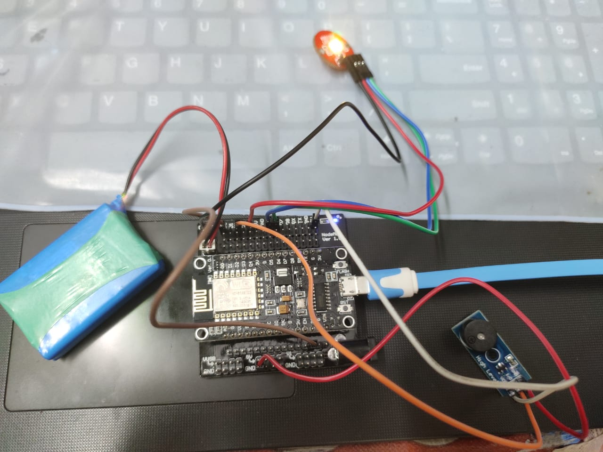
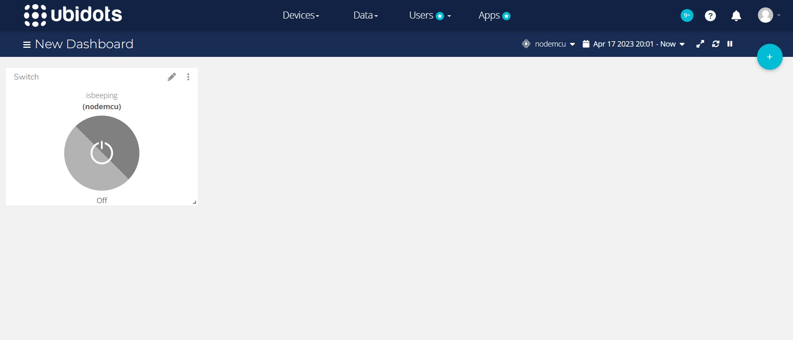

# Smart-keychain-finder

We have created a simple IoT-based Smart Key Chain to find the keys if they are misplaced. Our keychain is modified to not just work on LAN but also we can find our keychain even when not connected to the same network. User simply need to take out their phone, open Chrome, go to the Ubidots dashboard and click on the switch to hear _mario music_ coming(no need to tolerate the irritating beep sound on losing the keys) along with the _RGB LED_ blinking(YAYY!) from the keychain and with this, one can easily track their keys.

## Components Used
- ESP8266
- Buzzer
- Battery
- Led
- Jumper Wires

## Libraries Used
- ESP8266WiFi.h
- WiFiClient.h
- Ubidots.h
- pitches.h

## Circuit


## Connections
- Buzzer: D2
- Battery: negative to GND and positive to 3V

## Environment Setup
- Make all the necessary connections & write the sketch.
- Enter Wi-Fi credentials like the user name and password for the Wi-Fi router to which your NodeMCU should connect with in the code.
```
char ssid[] = "your-ssid";
char pass[] = "your-pass";
```
- Add your device on **Ubidots** and add the _isbeeping_ variable to it.
- Create a dashboard on Ubidots and add a switch widget linking it to the *isbeeping* variable.
- Add your corresponding Ubidots token, device label and variable label in the code.
```
#define TOKEN "your-token"
#define DEVICE_LABEL "your-device-label"
#define VARIABLE_LABEL "your-variable-label"
```
- Your Ubidots dashboard will look something like this:

